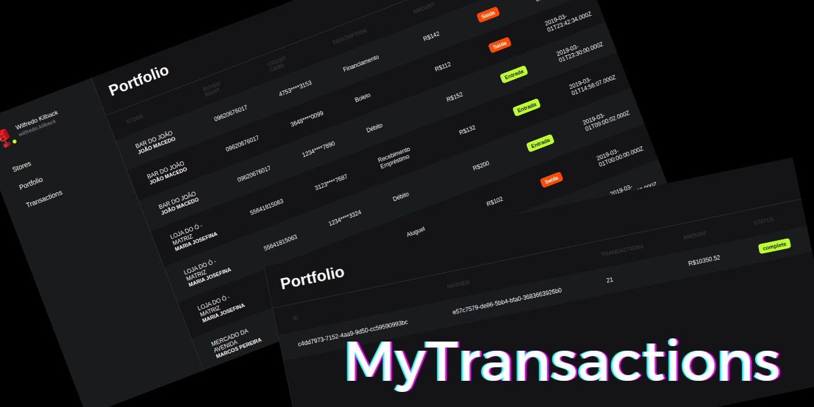

<p align="center">
    <a href="" rel="noopener">
        
    </a>
</p>

<h3 align="center">MyTransactions</h3>

<div align="center">

[](https://github.com/preduus/sportscore-api/issues)
[]()
[]()
[](/LICENSE)

</div>

---


## 📝 Table of Contents

- [About](#about)
- [Installing](#installing)
- [Usage](#usage)
- [Built Using](#built_using)
- [Contribute](#contribute)
- [License](#license)

## 🧐 About <a name="about"></a>

The idea of ​​the project is to process information related to financial transactions and store them in a database.
A simple approach was used, with some concepts of asynchronous processes in an ecosystem in docker and docker-compose, the communication is carried out through the internal docker network, simulating a private production environment.
Kafka was the library used to communicate between the services developed, with the aim of guaranteeing security in the processing of information and thinking about the UX.
## Prerequisites

What things you need to install the software and how to install them.

* [Docker](https://docs.docker.com/get-docker/)
* [Docker Compose](https://docs.docker.com/compose/install/)


## Installation

We chose to use [docker](https://docs.docker.com/get-docker/) and [docker compose](https://docs.docker.com/compose/install/) to develop this application. If you haven't installed it, you can find the installation steps [here](https://www.digitalocean.com/community/tutorials/how-to-install-and-use-docker-on-ubuntu-20-04-pt).

## 🎈 Usage <a name="usage"></a>

**To see API Documentation, [click here](https://documenter.getpostman.com/view/6161616/UVeJMRTa).**

You just go up the stack and use it. Run:
```bash
$ docker-compose up -d

Starting desafio-dev_postgresdb_1 ... done
Starting desafio-dev_zookeeper_1  ... done
Starting desafio-dev_kafka_1      ... done
Starting desafiodev-api           ... done
Starting desafio-dev_kafdrop_1    ... done
Starting desafiodev-parser        ... done
Starting desafiodev-seeds         ... done
Starting desafiodev-frontend      ... done
Attaching to desafio-dev_zookeeper_1, desafio-dev_postgresdb_1, desafio-dev_kafka_1, desafio-dev_kafdrop_1, desafiodev-api, desafiodev-parser, desafiodev-seeds, desafiodev-frontend
```

### Services available:
* Frontend Microservice: http://localhost:8000
* Server API Microservice: http://localhost:3100
* PostgreSQL Service: http://localhost:5433
* Kafka Service: http://localhost:9092
* Kafdrop Service: http://localhost:19000

#### Fake login
* Username: **desafiodev@email.com**
* Password: **desafiodev**

The project structure is simple. There are 4 microservices and some services available in the environment.

#### Microservices:
* [Server API](./backend/api)
* [Parser Service](./backend/parser)
* [Database Seeds](./backend/seeds)
* [Frontend](./frontend)

#### Services:
* [Apache Kafka](https://kafka.apache.org/)
* [Zookeeper](https://zookeeper.apache.org/)
* [Kafdrop](https://github.com/obsidiandynamics/kafdrop)
* [PostgreSQL](https://www.postgresql.org/)


**If you want to test it, just import the [API collection](./collection.json) into Postman.**

You can change params in [**compose.yml**](compose.yml) file.


## ⛏️ Built Using <a name="built_using"></a>

- [Docker](https://www.docker.com/)
- [Node.js](https://nodejs.org/)
- [Express](https://expressjs.com/)
- [Joi](https://joi.dev/api/)
- [PostgreSQL](https://www.postgresql.org/)
- [Sequelize ORM](https://sequelize.org/)
- [Apache Kafka](https://kafka.apache.org/)
- [Zookeeper](https://zookeeper.apache.org/)
- [Kafdrop](https://github.com/obsidiandynamics/kafdrop)

## 📝 License <a name="license"></a>

Distributed under the MIT License. See LICENSE for more information.