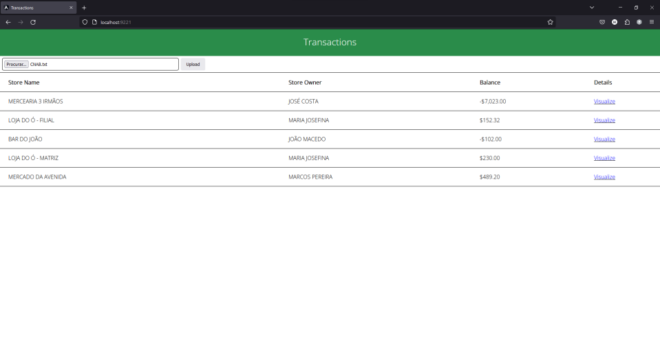
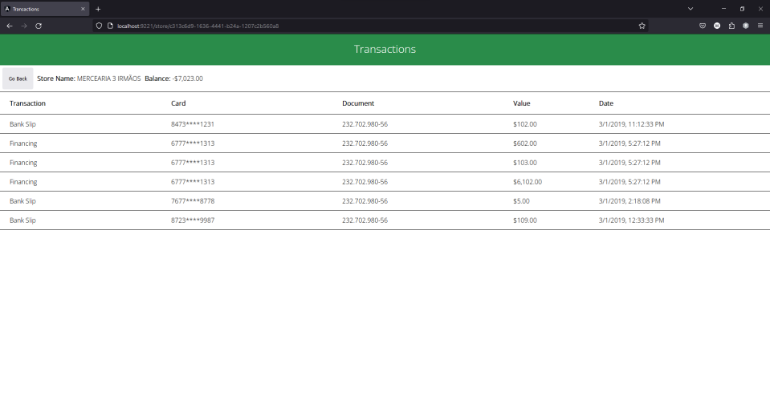

# Project: Transactions
# - Tecnologies
## Backend:
 - Clean Architecture
 - .NET 6
 - Entity Framework Core
 - AutoMapper
 - XUnit

## Frontend:
 - Angular 14
 - Angular Material

## Database:
 - SqlServer

# - Deploy
## Requirements to Deploy:
 - Linux
 - Docker
 - Docker Compose

## How deploy:
First, make sure that the ports 9221, 9222 and 9223 are not in use.

In the root directory, execute the following command:

```bash
docker-compose up --build
```

Upon successful execution, three containers will be created with their respective ports:

 - frontend-container (9221)
 - backend-container  (9222)
 - database-container (9223)

Access the UI via: http://localhost:9221

## Tests:
The backend has 24 unit tests. To run them, either utilize Visual Studio Test Explorer or execute the following command in the root directory:

```bash
(cd backend/Transactions/Transactions.UnitTests/ && dotnet test)
```

# - UI

## Home
On the home page, you can import transactions via CNAB.txt and view a list of all previously registered stores.


## Store Operations
In the store operations page, you can review detailed information about all the transactions of a specific store. Additionally, you can also view the store's name and current balance.


# - API

## Endpoint: POST http://localhost:9222/api/file/import

* Functionality: Gets the CNAB.txt, processes all transactions, and inserts them into the 'operations' table. If the processed transaction pertains to a new store, a new entry is created in the 'stores' table.
* Input: .txt file
```JSON
file
string($binary)
```

## Endpoint: GET http://localhost:9222/api/account/stores
* Functionality: Get all stores from 'stores' table.
```JSON
[
  {
    "id": "3fa85f64-5717-4562-b3fc-2c963f66afa6",
    "name": "Store 1",
    "ownerName": "Owner 1",
    "balance": 100
  },
  {
    "id": "d9ac4e88-bc6d-45de-9bc8-14105fc284bf",
    "name": "Store 2",
    "ownerName": "Owner 2",
    "balance": 200
  }
]
```

## Endpoint: GET http://localhost:9222/api/account/stores/{storeId}/operations
* Functionality: Retrieves the name, balance, and all transactions associated with a specific store.
* Param (storeId): Guid from a registered store.
```JSON
{
  "storeName": "Store 1",
  "balance": 200,
  "operations": [
    {
      "id": "68b72d71-82a2-4df5-8ecb-29f9ad3ab1d7",
      "transaction": "TED",
      "date": "2023-08-07T22:28:44.297Z",
      "value": 100,
      "document": "000.000.000-00",
      "card": "1234****1234"
    },
    {
      "id": "5b8dcde9-1629-4aa6-b01b-dc99a75833d5",
      "transaction": "DOC",
      "date": "2023-08-07T22:28:44.297Z",
      "value": 100,
      "document": "000.000.000-00",
      "card": "1234****1234"
    }
  ]
}
```